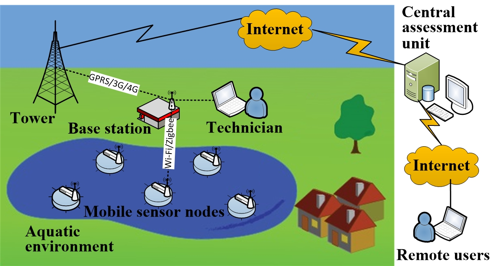
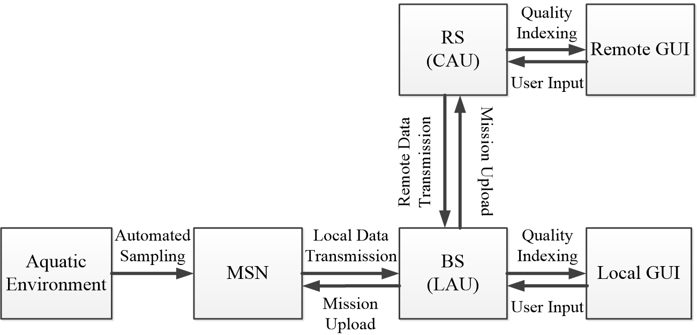
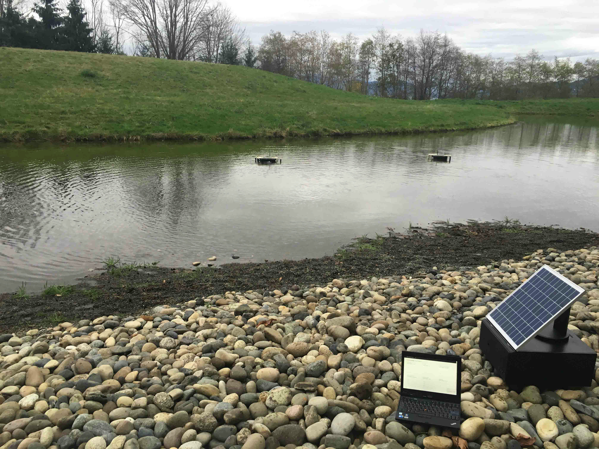
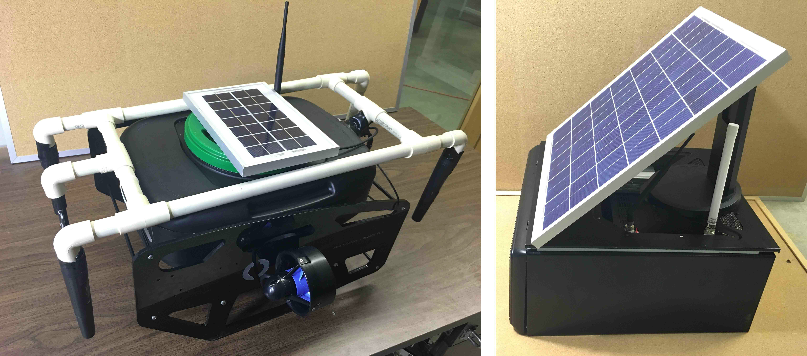

# Automated-environmental-monitoring

Research  Publication (co-author): "Automated Water Quality Survey and Evaluation Using an IoT Platform with Mobile Sensor Nodes," Sensors, 2017

Link to Publication: http://www.mdpi.com/1424-8220/17/8/1735

## Motivation of Project
Traditional aquatic environmental monitoring involves static sensor nodes and manual monitoring. To detect anomalies in a timely manner, this monitoring system requires large deployment of static sensor nodes and therefore are inflexible and expensive. This research achieves automatic and dynamic monitoring via low-cost mobile robots with flexible and intelligent sampling.

## Platform Overview

Low-cost Unmanned Surface Vehicles are developed as Mobile Sensor Nodes (MSNs) and distributed in the monitored field. The survey missions (sensing locations and moving paths) for the MSNs are generated at a Remote Server (RS) and transmitted to the MSNs via a Base Station (BS). The MSNs follow the received missions to collect data at the scheduled sampling locations. Each MSN consists of a set of heterogeneous sensors to measure different water quality parameters. The collected data is then transmitted to the base station (BS) through a local wireless network (e.g., Wi-Fi or Zigbee). 

The monitoring results are presented at the BS via a Local Assessment Unit (LAU) in two forms: (1) the measurements in terms of water quality parameters at the sampling locations; and (2) the online water quality index. The former form presents the quantitative measurements in the field. The latter form presents the qualitative evaluation of the surface water. The results are also transmitted to the RS with a Central Assessment Unit (CAU) running on it. Thus, the monitoring results can be accessed locally at the BS by the technicians in the field or accessed remotely by the users via the Internet.

Figure 1 and Figure 2 present the architecture and the workflow diagram of the platform. Figure 3 demonstrates the deployment of the platform in the field. Figure 4 shows the Unmanned Surface Vehicles and the base station.

**Figure1: architecture of the platform**

**Figure 2: workflow diagram of the platform**

**Figure 3: deployment of the platform in the field**

**Figure 4: Unmanned Surface Vehicles and base station**

## Acknowledgement

This work is supported by the IC-IMPACTS: India-Canada Centre for Innovative Multidisciplinary Partnership to Accelerate Community Transformation and Sustainability (Grant No. 11R18083). Figures are reproduced with permission from Teng Li, the primary author of the research publication. No reproduction is allowed without permission.

